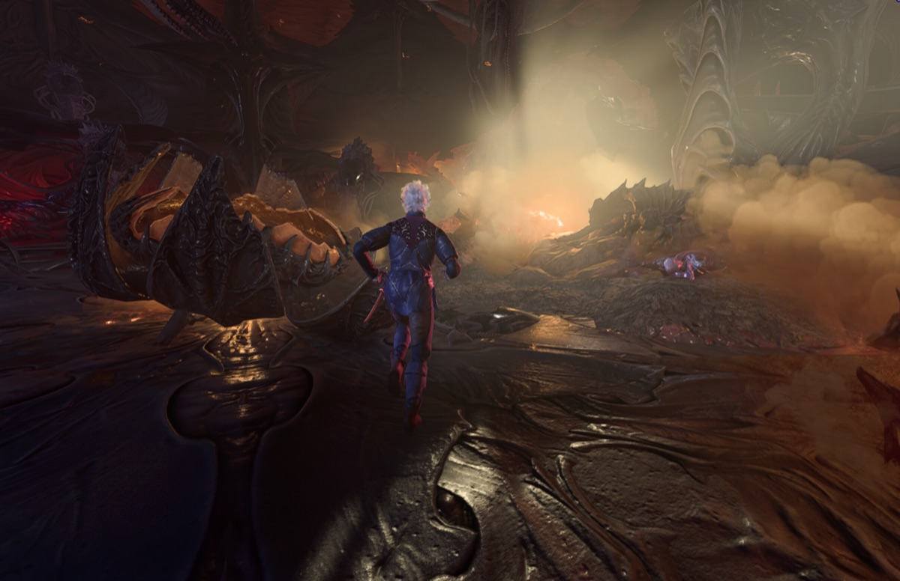
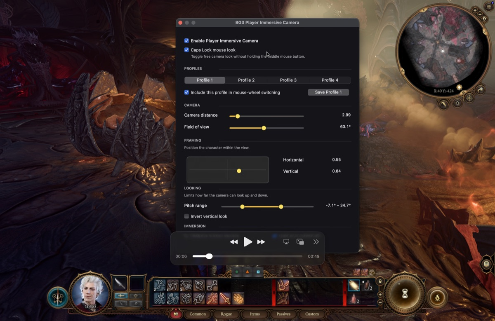

# BG3 Player Immersive Camera

A native macOS immersive camera and W/A/S/D movement mod for Baldur's Gate 3.

<p align="center">
  
</p>

## Features

- Direct W/A/S/D character movement
- Third-person camera with mouse-controlled horizontal and vertical rotation
- Caps Lock mouse look without holding the middle mouse button
- Four saved camera profiles and mouse-wheel profile switching
- Adjustable distance, FOV, framing, pitch range, and vertical inversion
- Optional UI hiding, adaptive crouch camera, and movement FOV
- Automatic vanilla camera and keyboard controls during combat
- Native settings panel opened with `\`

<p align="center">
  
</p>

## Requirements

- Apple Silicon Mac
- Steam version of Baldur's Gate 3
- BG3 version `4.1.1.7398727`

The native hooks are game-version-specific. The installer refuses unsupported
versions instead of patching unknown code.

## Install

1. Download and unzip the latest macOS release.
2. Quit Baldur's Gate 3 completely.
3. Right-click `Install.command`, choose **Open**, and confirm.
4. Launch BG3 normally through Steam and load a save.

The installer finds BG3, backs up affected files, installs the matching
[`bg3se-macos` fork](https://github.com/ldomaradzki/bg3se-macos/tree/compat/bg3-7398727),
installs the mod, and configures W/A/S/D. Testers do not need Xcode, Homebrew,
CMake, Git, or custom Steam launch options.

Press `\` in game to open settings. Saved profiles live outside the mod and are
preserved across reinstallations.

## Uninstall

Quit BG3, then right-click `Uninstall.command` and choose **Open**. The
uninstaller restores the game executable, previous Script Extender, previous
mod files, and keyboard bindings that existed before installation. Camera
profiles are kept.

## Development

This repository contains the Lua mod and release installer. Native camera,
input, movement, and AppKit APIs are maintained in
[`ldomaradzki/bg3se-macos`](https://github.com/ldomaradzki/bg3se-macos/tree/compat/bg3-7398727).

Build an unpacked tester package with:

```bash
./scripts/build-tester-package.sh 1.0.0
```

## Credits

- [Ersh's BG3 Native Camera Tweaks](https://github.com/ersh1/BG3_NativeCameraTweaks)
- [Ch4nKyy's BG3WASD](https://github.com/Ch4nKyy/BG3WASD)
- [tdimino's bg3se-macos](https://github.com/tdimino/bg3se-macos)

This is an independent native macOS implementation and does not include the
Windows DLLs. Licensed under GPL-3.0-or-later with the exceptions in
[EXCEPTIONS](EXCEPTIONS).
